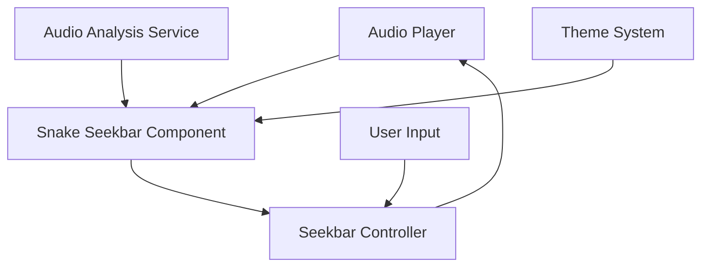

# Design Document: Snake Seekbar

## Overview

The Snake Seekbar is a visually distinctive and interactive component that replaces the traditional linear progress bar in our music player application. It represents playback progress as an animated snake that moves along a path as the music plays, providing both functional seeking capabilities and visual feedback based on audio characteristics.

This design document outlines the technical approach, component architecture, and implementation details for creating this feature within our Electron and React-based music player application.

## Architecture

The Snake Seekbar will be implemented as a React component that integrates with our existing audio playback system. The architecture consists of the following key elements:

1. **Snake Seekbar Component**: A React component responsible for rendering and animating the snake visualization.
2. **Audio Analysis Service**: A service that processes audio data to extract characteristics that influence the snake's appearance.
3. **Seekbar Controller**: A controller that handles user interactions and communicates with the audio playback system.
4. **Theme Integration**: Integration with the application's theming system for customization.

### System Context Diagram



## Components and Interfaces

### Snake Seekbar Component

The core visual component that renders the snake and handles animations.

#### Props Interface

```typescript
interface SnakeSeekbarProps {
  // Current playback position in seconds
  currentTime: number;

  // Total duration of the track in seconds
  duration: number;

  // Audio analysis data for visualization
  audioData?: AudioAnalysisData;

  // Callback when user seeks to a new position
  onSeek: (newPosition: number) => void;

  // Visual customization options
  theme: "light" | "dark";
  color?: string;
  size?: "small" | "medium" | "large";

  // Accessibility options
  ariaLabel?: string;
  showTooltip?: boolean;
}
```

#### Internal State

```typescript
interface SnakeSeekbarState {
  // Whether the user is currently dragging the snake
  isDragging: boolean;

  // Position of the mouse during drag operations
  dragPosition: { x: number; y: number } | null;

  // Animation frames for the snake's body segments
  snakeSegments: Array<{ x: number; y: number; intensity: number }>;

  // Whether the tooltip is currently visible
  isTooltipVisible: boolean;

  // Position and content for the tooltip
  tooltip: { position: number; time: string } | null;
}
```

### Audio Analysis Service

Service responsible for analyzing audio data to extract characteristics that will influence the snake's visualization.

#### Interface

```typescript
interface AudioAnalysisService {
  // Analyze an audio file and return analysis data
  analyzeAudio(audioBuffer: AudioBuffer): Promise<AudioAnalysisData>;

  // Get real-time analysis data for the current playback position
  getCurrentAnalysisData(position: number): AudioAnalysisData;
}

interface AudioAnalysisData {
  // Overall volume/intensity at various points in the track
  intensityMap: Array<{ position: number; intensity: number }>;

  // Frequency distribution data for visualization
  frequencyData?: Uint8Array;

  // Beat detection data
  beats?: Array<{ position: number; intensity: number }>;
}
```

### Seekbar Controller

Handles user interactions with the seekbar and communicates with the audio player.

#### Interface

```typescript
interface SeekbarController {
  // Handle click events on the seekbar
  handleSeekbarClick(event: React.MouseEvent): void;

  // Handle the start of a drag operation
  handleDragStart(event: React.MouseEvent): void;

  // Handle drag movement
  handleDrag(event: React.MouseEvent): void;

  // Handle the end of a drag operation
  handleDragEnd(event: React.MouseEvent): void;

  // Handle hover events for tooltip display
  handleHover(event: React.MouseEvent): void;

  // Convert a pixel position to a time position
  positionToTime(position: number): number;

  // Convert a time position to a pixel position
  timeToPosition(time: number): number;
}
```

## Data Models

### Snake Visualization Model

The snake will be represented as a series of connected segments that follow a path. Each segment has position and visual properties influenced by the audio data.

```typescript
interface SnakeSegment {
  // Position along the x-axis (0-100%)
  x: number;

  // Position along the y-axis (can vary based on audio characteristics)
  y: number;

  // Visual intensity/size of this segment (based on audio data)
  intensity: number;

  // Color variation for this segment (optional)
  colorModifier?: number;
}

interface SnakePath {
  // Array of segments forming the snake
  segments: SnakeSegment[];

  // Head position (represents current playback position)
  head: SnakeSegment;

  // Total length of the snake (in segments)
  length: number;
}
```

### Theme and Customization Model

```typescript
interface SnakeTheme {
  // Base color of the snake
  baseColor: string;

  // Secondary color for effects or gradient
  accentColor?: string;

  // Size multiplier for the snake
  sizeMultiplier: number;

  // Animation speed multiplier
  animationSpeed: number;

  // Visual effects to apply
  effects: {
    glow: boolean;
    pulse: boolean;
    trail: boolean;
  };
}
```

## Rendering and Animation Approach

The snake seekbar will be rendered using SVG for smooth scaling and animation capabilities. We'll use the following approach:

1. **Base Path**: A simple horizontal line representing the total duration of the track.
2. **Snake Body**: A series of SVG elements (circles or path segments) that form the snake's body.
3. **Animation**:
   - The snake's head position is directly tied to the current playback position.
   - The body segments follow the head with a slight delay, creating a snake-like movement.
   - Additional animations (like undulation) are applied based on audio characteristics.

### SVG Structure

```html
<svg class="snake-seekbar" aria-label="Audio progress">
  <!-- Base track path -->
  <path class="snake-track" d="M0,50 H600" />

  <!-- Snake body segments (generated dynamically) -->
  <g class="snake-body">
    <!-- Multiple circle or path elements representing segments -->
  </g>

  <!-- Snake head (current position) -->
  <circle class="snake-head" cx="150" cy="50" r="8" />

  <!-- Interactive overlay for seeking -->
  <rect
    class="seek-overlay"
    x="0"
    y="0"
    width="100%"
    height="100%"
    opacity="0"
  />

  <!-- Time tooltip (shown on hover) -->
  <g class="time-tooltip" transform="translate(150, 30)">
    <rect width="60" height="25" rx="4" />
    <text x="30" y="16" text-anchor="middle">1:45</text>
  </g>
</svg>
```

## Animation and Audio Visualization

The snake's movement and appearance will be influenced by the audio characteristics:

1. **Basic Movement**: The snake head moves linearly based on playback progress.
2. **Body Follow**: Body segments follow the head with physics-based movement (using spring physics for natural motion).
3. **Audio Reactivity**:
   - **Intensity**: The snake's thickness or glow can vary based on the volume/intensity of the current audio segment.
   - **Vertical Movement**: The snake can move vertically based on frequency data, creating wave-like patterns.
   - **Pulsing**: The snake can pulse or expand slightly on detected beats.

We'll use `requestAnimationFrame` for smooth animations and optimize performance by:

- Limiting the number of segments based on the component's size
- Using CSS transforms where possible
- Throttling audio analysis to avoid performance issues

## User Interaction

The seekbar will support the following user interactions:

1. **Click to Seek**: Clicking anywhere on the seekbar will move playback to that position.
2. **Drag to Seek**: Dragging the snake's head will scrub through the audio.
3. **Hover Feedback**: Hovering over the seekbar will show a time tooltip and highlight the potential seek position.

All interactions will be implemented with both mouse and touch support, with appropriate event handlers for each interaction type.

## Error Handling

1. **Audio Analysis Failures**: If audio analysis fails or is unavailable, the snake will fall back to a default animation pattern that still accurately represents playback progress.
2. **Performance Issues**: If performance monitoring detects frame rate drops, the system will automatically reduce animation complexity.
3. **Rendering Errors**: Any SVG rendering errors will be caught and the component will fall back to a simpler visualization.

## Accessibility Considerations

To ensure the snake seekbar is accessible to all users:

1. **Keyboard Navigation**:

   - Arrow keys will allow seeking in small increments
   - Page Up/Down for larger jumps
   - Home/End to jump to start/end

2. **Screen Reader Support**:

   - Appropriate ARIA attributes will be added
   - Time position will be announced when focused
   - Status changes will be communicated via aria-live regions

3. **Reduced Motion**:

   - Respect the user's reduced motion preferences
   - Provide a simpler visualization option with less animation

4. **High Contrast**:
   - Ensure sufficient contrast between the snake and background
   - Provide high contrast theme options

## Testing Strategy

### Unit Tests

1. **Component Rendering**: Test that the component renders correctly with various props.
2. **Interaction Logic**: Test click, drag, and hover handlers.
3. **Time Conversion**: Test conversion between pixel positions and time values.
4. **State Management**: Test state updates based on playback progress.

### Integration Tests

1. **Audio Player Integration**: Test that seeking via the snake seekbar correctly updates the audio player position.
2. **Theme Integration**: Test that theme changes are correctly applied to the seekbar.
3. **Audio Analysis Integration**: Test that audio analysis data correctly influences the visualization.

### Visual Regression Tests

1. **Appearance**: Snapshot tests to ensure visual consistency across updates.
2. **Animation**: Visual tests of animation behavior with mocked time progression.
3. **Responsive Behavior**: Tests at various screen sizes and orientations.

### Accessibility Tests

1. **Keyboard Navigation**: Test all keyboard interactions.
2. **Screen Reader Compatibility**: Test with popular screen readers.
3. **Color Contrast**: Verify sufficient contrast ratios.

## Performance Considerations

To ensure smooth performance, especially on lower-end devices:

1. **Segment Optimization**: Dynamically adjust the number of snake segments based on device performance.
2. **Animation Throttling**: Limit animation frame rate on devices with performance constraints.
3. **Lazy Audio Analysis**: Perform detailed audio analysis only when needed and cache results.
4. **Rendering Optimization**: Use CSS hardware acceleration and minimize DOM updates.

## Implementation Phases

The implementation will be broken down into the following phases:

1. **Basic Seekbar**: Implement a functional seekbar with basic snake visualization.
2. **User Interactions**: Add click, drag, and hover interactions.
3. **Audio Analysis**: Integrate audio analysis to influence the snake's appearance.
4. **Animation Refinement**: Enhance the snake's movement and visual effects.
5. **Accessibility**: Implement all accessibility features.
6. **Customization**: Add theme and customization options.
7. **Performance Optimization**: Optimize for performance across devices.

Each phase will be implemented incrementally, ensuring that the seekbar remains functional throughout the development process.
